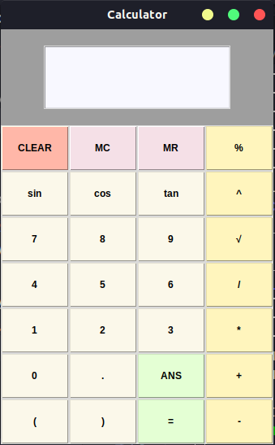

# Tubes-OOP-1
Dalam tugas besar ini, kami membuat sebuah kalkulator yang bisa digunakan untuk penghitungan beberapa operasi.

## Struktur file
        src/
        ├── code
        │   ├── main.py
        │   ├── App
        │   │   ├── App.py
        │   │   ├── Calculator.py
        │   │   └── icon.ico
        │   ├── Button
        │   │   ├── Button.py
        │   │   └── Buttons.py
        │   ├── Expression
        │   │   ├── BaseExpression
        │   │   │   └── Expression.py
        │   │   ├── BinaryExpression
        │   │   │   ├── AddExpression.py
        │   │   │   ├── BinaryExpression.py
        │   │   │   ├── DivExpression.py
        │   │   │   ├── ModExpression.py
        │   │   │   ├── MulExpression.py
        │   │   │   ├── PowerExpression.py
        │   │   │   └── SubExpression.py
        │   │   └── UnaryExpression
        │   │       ├── CosExpression.py
        │   │       ├── NegativeExpression.py
        │   │       ├── SinExpression.py
        │   │       ├── SqrtExpression.py
        │   │       ├── TanExpression.py
        │   │       ├── TerminalExpression.py
        │   │       └── UnaryExpression.py
        │   └── Process
        │       ├── Parser.py
        │       └── Process.py
        └── test
            ├── unittest_parser.py
            └── unittest_process.py

## Cara menjalankan aplikasi:
1. di linux :
 - buka terminal di directory ini
 - jalankan program dengan mengetikkan ./run.sh

2. di windows :
 - buka terminal di directory ini
 - jalankan program dengan perintah run.bat
